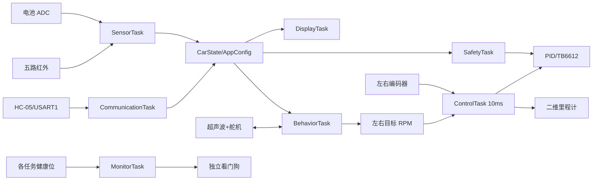

# 软件架构和 FreeRTOS 任务

## 1. 分层

```text
应用层 App       模式、PID、里程计、路线、安全、协议、参数
板级层 BSP       GPIO/TIM/ADC/UART/IWDG、电机、编码器、OLED
平台层 HAL/CMSIS STM32F1 外设和 Cortex-M3 内核
内核层 FreeRTOS  调度、任务、互斥量、信号量、StreamBuffer、heap_4
```

应用层不直接操作引脚，行为逻辑不直接操作 PWM。这样更换板级接线或控制策略时不会牵连
整个工程。

## 2. 数据流



## 3. 任务表

| 任务 | 优先级 | 周期/触发 | 主要职责 |
|---|---:|---|---|
| Safety | 6 | 50 ms | 急停、低电、超时、堵转、最终电机授权、故障历史 |
| Control | 5 | 10 ms | 编码器、RPM滤波、里程计、斜坡、双PID、堵转计时 |
| Comm | 4 | UART事件 | 字节流组帧、命令解析、参数和路线操作、响应 |
| Behavior | 3 | 50 ms | 五种模式、扫描避障、MOVE/TURN、路线连续执行 |
| Sensor | 2 | 20 ms | 五路红外；每 200 ms 电池采样 |
| Display | 1 | 250 ms | 状态页和里程计页轮换 |
| Monitor | 1 | 1 s | 健康位、IWDG、周期状态日志 |

优先级数字越大越高。安全任务可以抢占控制任务；控制任务可以抢占通信和显示，保证速度环
周期不被低优先级格式化或 OLED 刷新破坏。

## 4. 中断和任务间通信

- USART1 ISR 每次接收一个字节，放入 128 字节 StreamBuffer。
- CommunicationTask 从流中取字节，遇到 CR/LF 后解析完整命令。
- HC-SR04 PA4 双边沿中断记录 DWT 微秒时间，下降沿释放二值信号量。
- UART 发送由互斥量保护，避免监控日志和命令回复交错。
- `CarState`/`AppConfig` 的短复制使用临界区；临界区内禁止耗时外设操作。

USART1 和 EXTI4 使用 NVIC 优先级 6，符合 FreeRTOS ISR API 的最大系统调用中断优先级
配置。数值更小代表硬件优先级更高，不可随意改成 0。

## 5. 控制链

```text
行为/命令目标 RPM
  -> SafetyTask 判断是否允许运动
  -> ControlTask 加速度斜坡
  -> 左右 PID
  -> signed PWM 百分比
  -> BSP_MotorSet
  -> TB6612
  -> 电机/编码器反馈
```

出现故障时 SafetyTask 会清零最终目标并取消当前路线，ControlTask 直接复位斜坡和 PID、
关闭 TB6612 STBY，不等待平滑减速。

## 6. 配置和 Flash

启动时 `App_Init()` 扫描最后一页 Flash，加载序号最新且 CRC 正确的参数；没有合法记录时
使用默认值。在线修改只改变 RAM，显式 `SAVE` 后才写 Flash。

## 7. C8T6 资源策略

- 不使用全屏 OLED framebuffer，按行发送固定 128 字节缓冲。
- 故障日志和路线队列使用定长数组，不使用链表。
- 不创建软件定时器任务。
- C8T6 FreeRTOS heap_4 为 10 KB。
- Flash 参数区由链接器硬性隔离。
- 浮点只在任务中使用，不在 ISR 中使用。

## 8. 看门狗

IWDG 约 2 秒超时。Control、Safety、Comm、Behavior、Sensor、Display 六个任务必须在监控
窗口内上报健康位。Monitor 只有在全部正常时才喂狗；缺失健康位会记录任务停滞、停止喂狗
并最终硬件复位。复位后 `DIAG` 可通过 reset 位看到 IWDG 原因。
